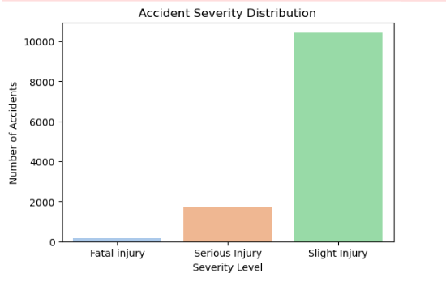
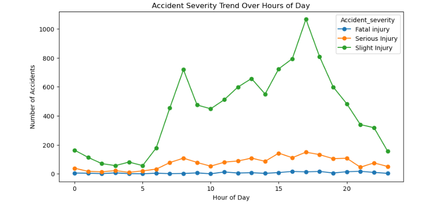
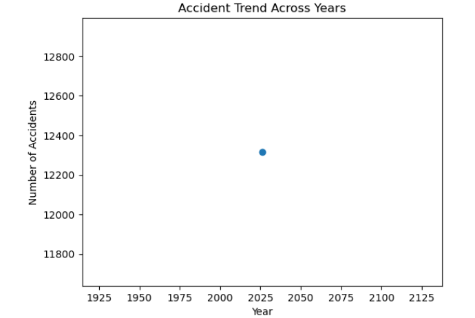
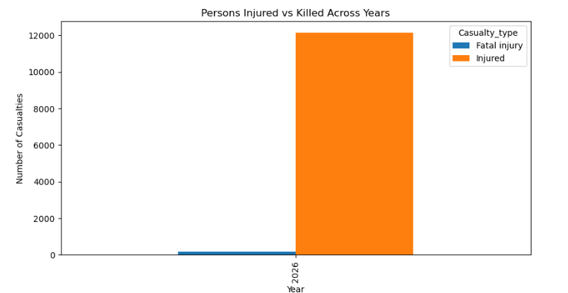
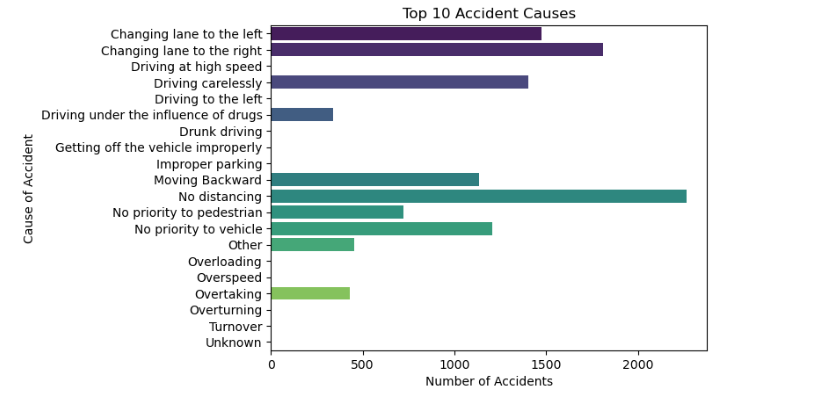

# Road Accident Severity Analysis in India EDA

📌 Project Objective
Exploratory Data Analysis on Road Accident Severity Analysis in India  using Python and libraries. Analyze trends, visualize patterns, and summarize key insights to understand accident patterns.

🛠 Skills / Tools
- Python
- Pandas
- NumPy
- Matplotlib
- Seaborn

📂 Dataset
- Dataset used: [Download here](https://drive.google.com/file/d/17UJaPS_inD8v-ikAzdZJFPEpXrELGWIu/view?usp=drive_link)

🖼 Images / Plots

Insights:
- Most accidents are minor → focus on reducing minor accidents.
- Severe accidents are less frequent → stricter safety rules or quick response needed.
- Moderate accidents → target with awareness campaigns or road safety policies.

Insights:
- Slight injuries are the most common and increase during peak hours.
- Serious injuries are relatively stable or slightly increasing.
- Fatal accidents are rare but should still be monitored; preventive measures should focus on peak hours.
  

Insights:
- Slight injuries dominate and show an increasing trend over the years.
- Serious injuries are relatively stable or slightly increasing.
- Fatal accidents remain low but need monitoring; trends help plan long-term road safety strategies.
  

Insights:
- The number of accidents changes year by year, indicating increasing or decreasing trends.
- Slight injuries dominate, while fatalities remain low.
- Helps assess whether road safety is improving or worsening.
  

Insights:
- Most accidents result in slight injuries.
- Main causes: overtaking, lane changes, lack of distancing.
- Focus on driver awareness and enforcing traffic rules to reduce accidents.

📋 What it Does
- Cleans and analyzes road accident data
- Visualizes patterns and trends using plots
- Summarizes key insights for better understanding of accident scenarios

🏗 Steps / Approach
1. Data Cleaning: Handle missing values, correct data types, remove duplicates
2. Exploratory Data Analysis (EDA): Identify trends and patterns in the data
3. Data Visualization: Plot graphs to visualize accident severity, time, location, etc.
4. Insights: Summarize findings and observations

🗓 Submission Date
06-01-2026

🎯 Career Relevance
- Demonstrates Python, EDA, and data visualization skills
-  Highlights ability to analyze real-world datasets and extract insights

